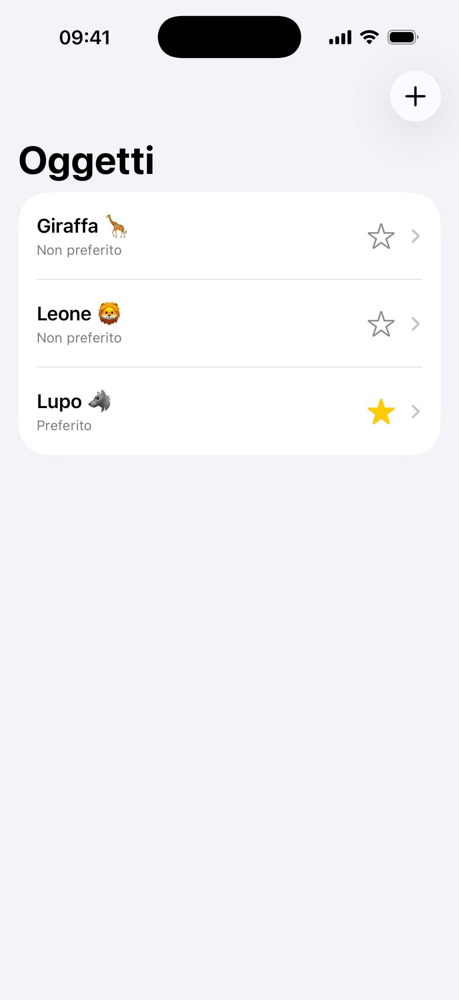
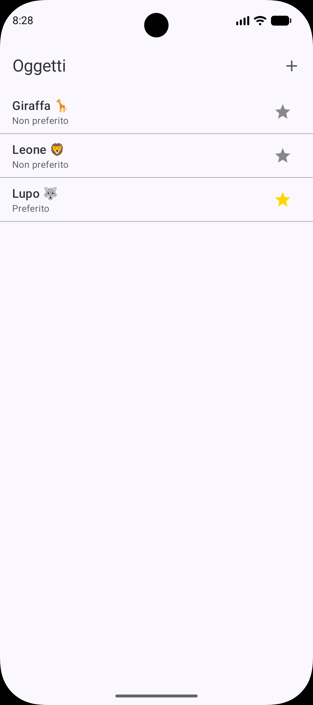
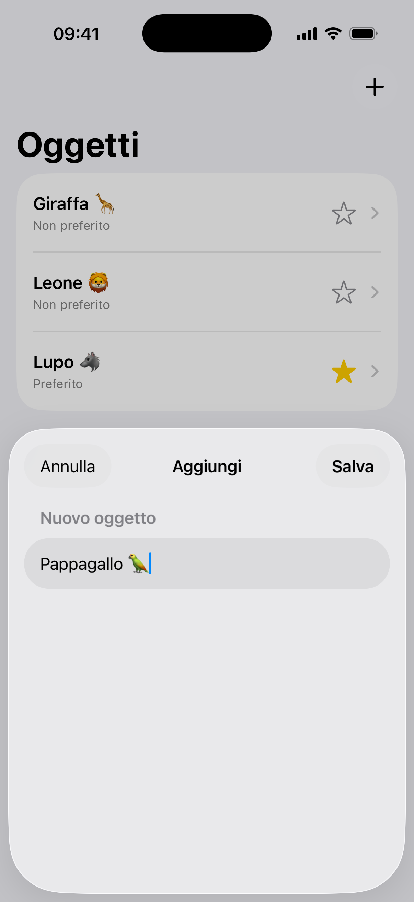
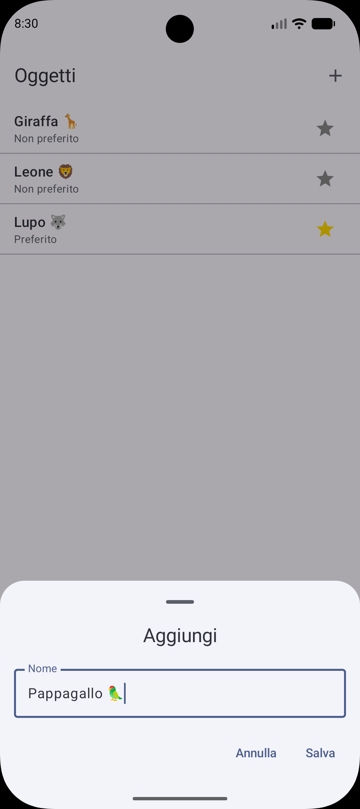
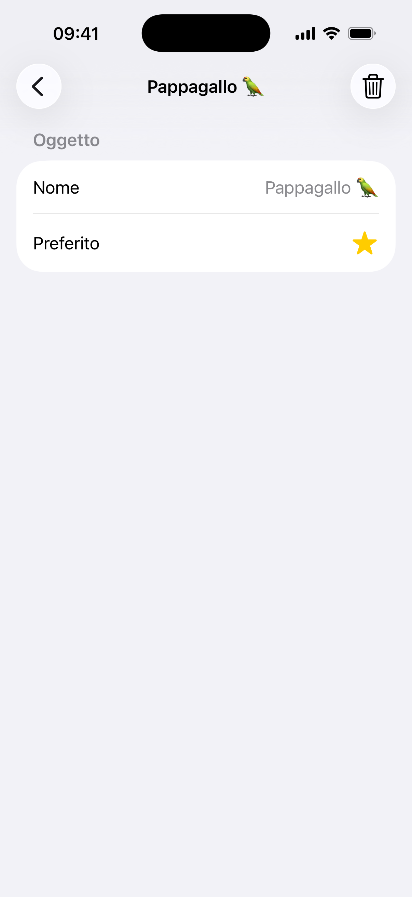
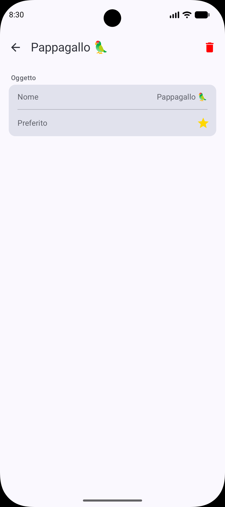
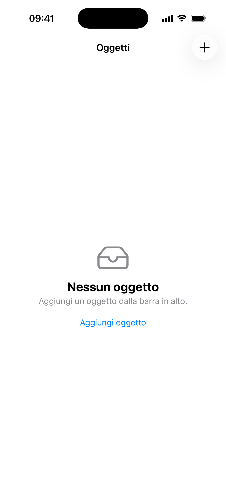
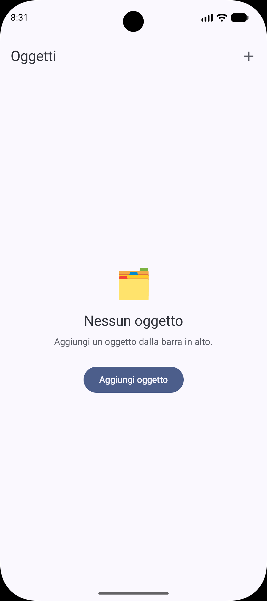

# AcademyTest 2026

A hands-on exercise in **translating a SwiftUI iOS app into Kotlin + Jetpack Compose for Android**, preserving identical functionality, architecture, and UI language across both platforms.

---

## Table of Contents

- [Screenshots](#screenshots)
- [What this repository is](#what-this-repository-is)
- [The App](#the-app)
- [Swift → Kotlin Translation](#swift--kotlin-translation)
- [Repository Structure](#repository-structure)
- [Running the Apps](#running-the-apps)
- [Branch Strategy](#branch-strategy)
- [How AI Fit Into the Workflow](#how-ai-fit-into-the-workflow)

---

## Screenshots

Each screen shown as **iOS (SwiftUI) → Android (Compose)**:

| Screen | iOS | Android |
|---|---|---|
| **Item List** |  |  |
| **Add Item** |  |  |
| **Item Detail** |  |  |
| **Empty State** |  |  |

---

## What this repository is

The repo contains two complete, working apps that do the same thing:

| | iOS | Android |
|---|---|---|
| **Language** | Swift | Kotlin |
| **UI framework** | SwiftUI | Jetpack Compose |
| **Architecture** | MVVM with `@Observable` | MVVM with `ViewModel` |
| **Location** | `Swift_project/` | `Kotlin_project/` |

The iOS app is the **source of truth**. The Android app is its line-by-line equivalent — same screens, same data flow, same Italian UI copy, same behavior.

---

## The App

A simple item manager (in Italian) with three screens:

- **Item list** — alphabetically sorted, swipe to delete, star to favorite
- **Add item** — bottom sheet with a text field
- **Item detail** — card view with name, favorite toggle, and a delete button

---

## Swift → Kotlin Translation

This is the core of the exercise. Every SwiftUI concept maps to an idiomatic Compose equivalent:

| SwiftUI (iOS) | Jetpack Compose (Android) |
|---|---|
| `struct Item` (value type) | `data class Item` (immutable, `.copy()` to mutate) |
| `@Observable class ViewModel` | `class ViewModel : ViewModel()` + `mutableStateListOf` |
| `@Bindable` two-way binding | State hoisting: value down, `onXxx: () -> Unit` lambda up |
| `@State` owned by a view | `viewModel()` from `lifecycle-viewmodel-compose` |
| `NavigationSplitView` | `NavHost` with `"list"` and `"detail"` destinations |
| `List + .onDelete` | `LazyColumn + SwipeToDismissBox` |
| `.sheet(item:)` | `ModalBottomSheet` gated by a `Boolean` flag |
| `ContentUnavailableView` | Custom empty-state composable |
| `ToolbarItem(placement: .topBarTrailing)` | `TopAppBar(actions = { ... })` |
| `@Environment(\.dismiss)` | `onDismiss: () -> Unit` lambda passed from parent |
| `Form { Section("...") }` | `Card` with `HorizontalDivider` inside a `Column` |
| `#Preview` | `@Preview(showBackground = true)` |

### The key rule: immutability

Swift uses `struct` (value types) — mutations produce new copies automatically. Kotlin's `data class` requires you to be explicit:

```swift
// Swift — mutation is automatic
item.isFavorite = true
```

```kotlin
// Kotlin — always replace with a copy
items[index] = item.copy(isFavorite = true)
```

### State flows one way

Both apps follow the same unidirectional data flow. No child view/composable writes state directly — all changes go through the ViewModel:

```
ViewModel (source of truth)
    ↓ state passed down as parameters
  Screen composable
    ↑ events passed up as lambdas (onToggleFavorite, onDelete, …)
```

---

## Repository Structure

```
AcademyTest2026/
├── Swift_project/          # iOS source app (Xcode)
│   └── AcademyTest/
│       ├── Models/         # Item.swift, ItemsListViewModel.swift
│       └── Views/          # ContentView, ItemsListView, ItemDetailView, …
│
├── Kotlin_project/         # Android target app (Android Studio)
│   └── app/src/main/java/com/example/academytest2026/
│       ├── model/          # Item.kt
│       └── ui/             # All composables + ViewModel
│
└── CLAUDE.md               # AI assistant instructions for this repo
```

---

## Running the Apps

### iOS — Xcode

1. Open `Swift_project/AcademyTest.xcodeproj` in Xcode.
2. Select a simulator and press `Cmd+R`.

### Android — Android Studio

1. **Open the project** — in Android Studio choose *File → Open* and select the `Kotlin_project/` folder (not the repo root). Wait for the Gradle sync to complete.
2. **Set up a device** — either connect a physical Android device (API 26 / Android 8.0 or higher) via USB with developer mode enabled, or create an emulator via *Device Manager → Create Virtual Device*.
3. **Run** — select your device from the toolbar dropdown and press the green **Run** button (or `Shift+F10`). The app will build, install, and launch automatically.

**Previews (no device needed):** Almost every composable file ships with one or more `@Preview` functions — `ItemRow`, `FavoriteButton`, `AddItemSheet`, `ItemsListScreen`, `ItemDetailScreen`, and `ContentScreen` all have previews. Open any of these files in Android Studio and click **Split** or **Design** in the top-right corner of the editor to render them instantly without a running device.

**Or build from the terminal** (inside `Kotlin_project/`):

```bash
./gradlew assembleDebug
```

---

## Branch Strategy

| Branch | Purpose |
|---|---|
| `production` | Stable releases only |
| `develop` | Default working branch |
| `feature/*` | One branch per screen/feature, merged to `develop` via PR |

---

## How AI Fit Into the Workflow

I used **Claude Code** as a working partner throughout this project to close the gap between a language I know well (Swift) and one I had little experience with (Kotlin). And to help me generate code.

**1. Setup.** I started by creating the repository and a solid `.gitignore` covering both Swift and Kotlin build artifacts, so the project was clean from the beginning.

**2. Learning before coding.** Before writing any Kotlin, I asked Claude Code to walk me through how the *same app* would need to be structured differently in Kotlin/Compose versus Swift/SwiftUI. This mattered more to me than getting working code fast: since I have limited Android experience, I treated this as a genuine learning opportunity to understand *what I was about to face*. Expanding my own knowledge was the priority during this task.

**3. Analyzing the source app first.** Before porting anything, I also asked Claude to analyze the Swift codebase itself and point out any weak points, strange patterns, fragile logic, anything not worth carrying over Kotlin. The goal was to avoid translating a weakness from Swift into Kotlin. **That's how i found out the accented letters weakness when ordering the items in alphabetical order!**

**4. Planning before building.** Once I understood the main syntax and architectural differences, I worked with AI to draft a detailed implementation plan. I made sure to stay heavily involved in shaping it, being as precise as possible about the architecture and the steps I envisioned. This is also why I enforced a strict `feature` → `develop` → `production` branch discipline: the goal was broad, so I wanted to break it into small, one-problem-at-a-time, achievable milestones.

**5. Guided implementation.** With the plan in hand, I built the Kotlin project step by step, following it closely. Coding in a language I am not proficient in became far more manageable thanks to that plan and to Claude Code's assistance along the way. I kept `CLAUDE.md` updated after each work session, so the project's context and conventions stayed accurate for future sessions. Consider the usage of AI as a coding and learning partner: someone I can always ask something that will always answer and teach me.

**6. Documentation.** Finally, AI helped me summarize the finished work into this README, aiming for something clear, accurate, and understandable even to a complete beginner.

### What this project deliberately does *not* cover

This is a small learning project, not production software, even tho I made a "production" branch, but it was to simulate a team's work. **I did not run any security review, did not check for memory leaks, did not write unit tests, and did not scan the code for bugs or weaknesses.** That was a conscious choice: my goal here was to learn how to transpose Swift logic into Kotlin logic, in a language I am not yet proficient in. Everything in this repository should be read through that lens.

---
> *That's my effort in translating a Swift app into a Kotlin app. It has been an interesting and stimulating hot neapolitan july afternoon since I took this occasion to practice more my developer skills! With this exercise I also had the opportunity to deep dive into Android coding and learn more how the structure, logic and syntax of it is different from Swift. Very nice evening, overall. Thank you! ❤️*
